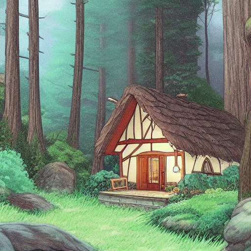
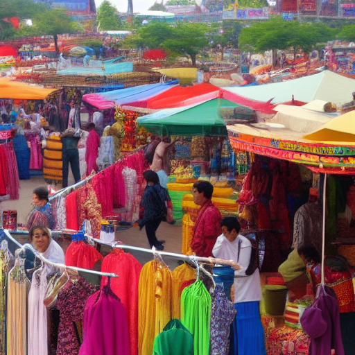
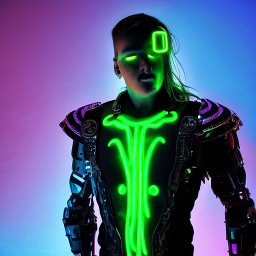
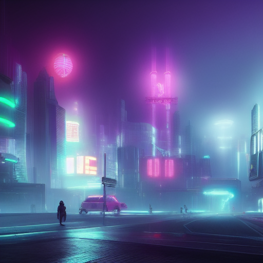
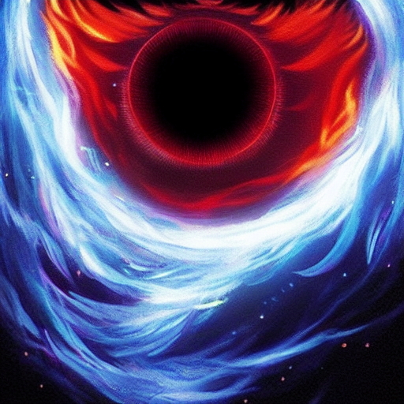

# ComfyUI_Model
Analysis of image generation accuracy, drawbacks, and future advancements in ComfyUI (Stable Diffusion).
# Image Generation Using Stable Diffusion and Comfy UI

## Project Description
This project focuses on generating high-quality images using **Stable Diffusion** and **Comfy UI**. The goal is to explore the capabilities of AI in creative applications by generating images from textual prompts. The project also delves into the technical foundations of Stable Diffusion, including concepts like U-Net architecture and latent diffusion models.

## Generated Images
Below are the images generated using Stable Diffusion and Comfy UI:

- **Image 1:** A red apple on a wooden table
  

- **Image 2:** A cozy cottage in the forest, Studio Ghibli style
  

- **Image 3:** A futuristic city covered in heavy fog and neon lights
  

- **Image 4:** A cyberpunk warrior with neon tattoos and a robotic arm
  

- **Image 5:** A busy marketplace with colorful stalls, people interacting
  

- **Image 6:** A dragon made of fire and ice, glowing eyes
  

- **Image 7:** A giant, ultra-detailed, perfectly spherical glass orb floating in the sky, reflecting a sunset over a vast futuristic city. The city has towering triangular skyscrapers with symmetrical neon-lit patterns. The perspective is wide-angle, capturing depth with a cinematic 16:9 aspect ratio. The scene is illuminated by golden-hour lighting, with soft reflections on the orb's surface. The ground features a hexagonal grid structure. The background fades into a misty horizon, adding a sense of depth and dimension.
  

## How to Use This Repository
- **Images Folder:** All generated images are stored in separate files.
- **Project Report:** The project report is available in the `report/` folder.

## Tools and Technologies
- **Stable Diffusion:** A deep learning model for generating images from textual prompts.
- **Comfy UI:** A user interface for interacting with Stable Diffusion.
